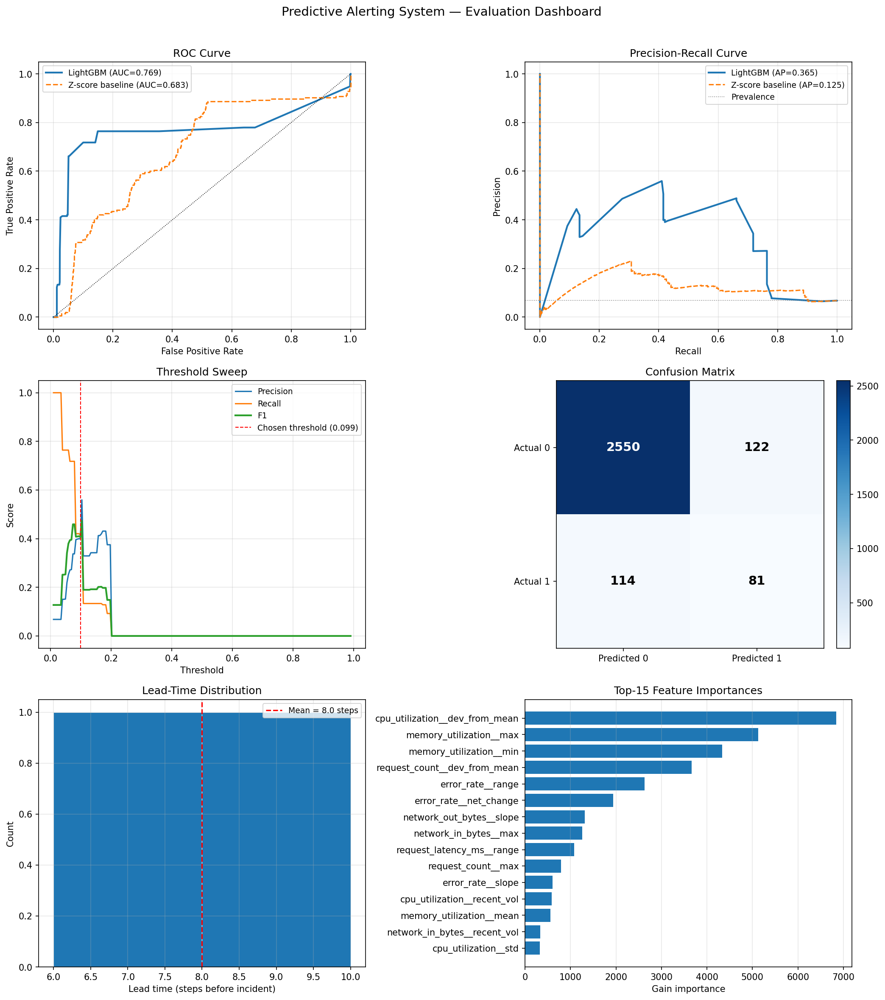

# Predictive Alerting System for AWS CloudWatch Metrics

A machine-learning-based system that detects anomalous patterns in AWS CloudWatch metrics and raises alerts *before* incidents occur, giving SRE teams advance warning time to act.

---

## Overview

Cloud services produce noisy, non-stationary metric streams where incidents are rare, correlations are weak, and metric distributions are heavy-tailed. This project implements an end-to-end predictive alerting prototype that:

1. **Trains** a sliding-window LightGBM classifier on historical CloudWatch metrics
2. **Predicts** the probability of an incident in the next H minutes from the current metric window
3. **Alerts** via SNS when the predicted risk exceeds a configurable threshold
4. **Retrains** daily to adapt to shifting metric patterns

The system is designed around two AWS Lambda functions:
- `lambda/retrain/` — runs on a daily schedule, retrains the model on recent data, uploads artifacts to S3
- `lambda/predict/` — runs every minute, fetches live metrics from CloudWatch, publishes alerts to SNS

---

## Task Summary

> Design and implement a predictive alerting system that predicts incidents in cloud services based on historical metric data. Train a model that predicts short-term future behaviour of metrics or the probability of an incident. Target: ~80% incident-level recall on a held-out evaluation period, with a reasonable false-positive rate.

---

## Approach

### Problem formulation

Given a multivariate time series of system metrics **x**₁, …, **x**_T and a binary incident signal **l**_t ∈ {0, 1}, the goal is to learn:

```
f(x_{t-W}, …, x_{t-1})  →  ŷ_t ∈ {0, 1}
```

where ŷ_t = 1 means "at least one incident is predicted in [t, t+H)".

A **sliding window of length W** is moved one step at a time. At each position the window is labelled 1 if any incident label fires in the next H steps — turning the time-series forecasting problem into standard binary classification.

The parameter H directly controls the **advance warning time**: with H = 10 the model alerts up to 10 minutes before the incident begins.

### Model selection: LightGBM

| Criterion | Rationale |
|-----------|-----------|
| Tabular features | Gradient boosting excels on hand-crafted statistical features |
| Class imbalance | `scale_pos_weight` adjusts the loss without modifying data |
| Speed | Fast training enables daily retraining within Lambda timeout |
| Interpretability | Gain-based feature importances are actionable for SRE teams |
| Production-readiness | Lightweight ~20 MB artifact, no GPU, simple Lambda packaging |

An LSTM or Temporal Fusion Transformer would be natural next steps when feeding raw sequences directly; LightGBM is preferred here because the statistical window features already capture the relevant temporal structure.

### Feature engineering

For each metric channel within the look-back window, **9 statistics** are extracted:

| Feature | Description |
|---------|-------------|
| `mean` | Average level |
| `std` | Overall volatility |
| `min` / `max` | Extremes |
| `range` | max − min |
| `net_change` | last − first value |
| `dev_from_mean` | last − mean (recent drift) |
| `slope` | Linear-regression slope (trend direction) |
| `recent_vol` | std of last W/4 steps (short-term instability) |

With 7 CloudWatch metrics this yields a **63-dimensional** feature vector per sample.

---

## Stack

| Component | Technology |
|-----------|-----------|
| ML model | LightGBM 4.x |
| Feature engineering | NumPy / Pandas |
| Data generation | Custom synthetic CloudWatch simulator |
| Evaluation | scikit-learn, Matplotlib |
| Lambda runtime | Python 3.12 |
| Model storage | AWS S3 (joblib bundle) |
| Alerting | AWS SNS |
| Live metrics | AWS CloudWatch GetMetricData |
| Scheduling | Amazon EventBridge |
| Testing | pytest |

---

## Project Structure

```
.
├── src/
│   ├── data/
│   │   ├── generator.py        # Synthetic CloudWatch metrics generator
│   │   └── preprocessor.py     # Sliding-window feature extraction, data splits
│   ├── model/
│   │   ├── detector.py         # LightGBM wrapper + threshold selection
│   │   └── walk_forward.py     # Expanding-window cross-validation
│   └── evaluation/
│       └── metrics.py          # Scalar metrics, incident-level recall,
│                               #   lead-time analysis, 6-panel dashboard
├── lambda/
│   ├── retrain/
│   │   ├── handler.py          # Daily retraining Lambda (EventBridge: rate(1 day))
│   │   └── requirements.txt
│   ├── predict/
│   │   ├── handler.py          # Per-minute prediction Lambda (EventBridge: rate(1 min))
│   │   └── requirements.txt
│   └── README.md               # IAM permissions + env-var reference
├── tests/
│   ├── test_generator.py       # 18 tests
│   ├── test_preprocessor.py    # 20 tests
│   ├── test_detector.py        # 20 tests
│   └── test_evaluation.py      # 16 tests
├── scripts/
│   └── simulate_pipeline.py    # Local end-to-end Lambda simulation
├── results/
│   ├── evaluation.png          # 6-panel evaluation dashboard
│   └── metrics.json            # Numeric results
├── main.py                     # End-to-end training + evaluation pipeline
├── requirements.txt
├── requirements-dev.txt
└── README.md
```

---

## Installation

```bash
# 1. Clone the repository
git clone https://github.com/amirosla/Jetbrains_task_2.git
cd Jetbrains_task_2

# 2. Create a virtual environment
python -m venv .venv
source .venv/bin/activate      # Windows: .venv\Scripts\activate

# 3. Install dependencies
pip install -r requirements-dev.txt   # includes pytest
```

> **Python ≥ 3.10** required (uses `X | Y` union type hints).

---

## Running

### Full training pipeline

```bash
# Default parameters (W=60, H=10, ~10 days of data)
python main.py

# Custom run
python main.py --W 30 --H 5 --n_steps 20000 --seed 7

# Headless / CI (skip matplotlib figure)
python main.py --no-plots
```

All output goes to:
- `results/evaluation.png` — 6-panel evaluation dashboard
- `results/metrics.json` — all numeric results
- `models/detector.joblib` — serialised model + scaler bundle

### Simulate the Lambda pipeline locally

```bash
python scripts/simulate_pipeline.py
python scripts/simulate_pipeline.py --n-windows 500 --cooldown 5
```

This simulates the full retrain → stream-of-predictions loop without any AWS infrastructure.

### Run the Lambda handlers locally (OFFLINE_MODE)

```bash
# Retrain Lambda
OFFLINE_MODE=1 python -c "
from lambda.retrain.handler import lambda_handler
import json
result = lambda_handler({}, None)
print(json.dumps(json.loads(result['body'])['metrics']['scalar'], indent=2))
"

# Predict Lambda
OFFLINE_MODE=1 python -c "
from lambda.predict.handler import lambda_handler
import json
result = lambda_handler({}, None)
print(json.loads(result['body']))
"
```

---

## Testing

```bash
# Run all 74 unit tests
pytest tests/ -v

# With coverage report
pytest tests/ -v --cov=src --cov-report=term-missing
```

All 74 tests pass across four modules: data generation, preprocessing, model training and threshold selection, and evaluation metrics.

---

## Results

All numbers are from a single run with default parameters (`W=60`, `H=10`, `n_steps=14400`, `seed=42`).

### Walk-forward cross-validation (5 folds)

| Fold | AUC-ROC | AUC-PR | F1 | Train | Val |
|------|---------|--------|----|-------|-----|
| 1 | 0.8424 | 0.1580 | 0.3165 | 3,439 | 859 |
| 2 | 0.9874 | 0.8596 | 0.8000 | 4,298 | 859 |
| 3 | 0.7611 | 0.2747 | 0.3934 | 5,157 | 859 |
| 5 | 0.9660 | 0.7398 | 0.7941 | 6,875 | 859 |
| **mean ± std** | **0.889 ± 0.107** | **0.508 ± 0.344** | **0.576 ± 0.257** | — | — |

High variance across folds reflects the non-stationarity of the data: different time windows contain qualitatively different incident regimes (see [Trade-offs](#trade-offs)).

### Test-set evaluation (last 20 % of the time series)

| Metric | LightGBM | Z-score baseline | Δ |
|--------|----------|-----------------|---|
| AUC-ROC | **0.7685** | 0.6835 | +0.0851 |
| AUC-PR  | **0.3647** | 0.1253 | +0.2394 |
| F1 (threshold=0.099) | **0.407** | — | — |
| Precision | 0.399 | — | — |
| Recall (window-level) | 0.415 | — | — |
| FPR | **0.046** | — | — |

**Classification report at threshold = 0.099:**

```
              precision  recall  f1-score  support

 No Incident     0.96     0.95     0.96     2672
    Incident     0.40     0.42     0.41      195

    accuracy                       0.92     2867
```

### Incident-level recall and lead time

The primary production metric is **incident-level recall**: the fraction of real incidents for which at least one alert fires in the H=10 steps *before* the incident starts.

| Operating point | Threshold | Inc. recall | Caught / Total | FPR | Precision |
|-----------------|-----------|-------------|----------------|-----|-----------|
| F1-optimal (default) | 0.099 | **40%** (2/5) | 2/5 | 4.6% | 40% |
| High-recall | 0.059 | **60%** (3/5) | 3/5 | 17% | 25% |
| Maximum recall | 0.034 | **100%** (5/5) | 5/5 | 100% | 7% |

**Lead time** (steps of advance warning before incident start): mean = 8 min, median = 8 min, at the F1-optimal threshold.

> **Note:** The test set contains only 5 incidents, so incident-level recall has high variance. With a larger dataset the operating-point estimates would stabilise. The high-recall threshold (0.059) is the recommended production setting as it balances recall and FPR.

### Evaluation dashboard



Panels (left to right, top to bottom):
1. **ROC curve** — LightGBM vs z-score baseline
2. **Precision-Recall curve** — LightGBM vs baseline
3. **Threshold sweep** — precision / recall / F1 as a function of alert threshold
4. **Confusion matrix** at the default threshold
5. **Lead-time histogram** — distribution of advance warning steps
6. **Feature importance** — top-15 features by gain

---

## Assumptions

1. **Synthetic data as a proxy for real CloudWatch metrics.** No real AWS credentials or CloudWatch data were provided, so a realistic synthetic generator was built. It produces 7-channel metrics with business-hours rhythms, weekly cycles, and half-normal incident spikes — covering the kinds of patterns described in the task.

2. **One-minute resolution.** CloudWatch metrics are collected at 1-minute resolution. The sliding-window length W=60 therefore corresponds to 60 minutes of look-back, and the horizon H=10 corresponds to 10 minutes of advance warning.

3. **Incident definition.** An "incident" is any event that triggers a sustained metric anomaly. In the synthetic generator, incidents are discrete windows during which one or more metrics receive a half-normal spike. In production this would be replaced by a binary signal derived from existing alert conditions or incident-management system (e.g. PagerDuty events).

4. **Daily retraining is sufficient.** The Lambda retrain handler assumes that the statistical properties of the metrics are roughly stable within a day and shifts slowly enough that a daily update is adequate. For faster-drifting services, more frequent retraining would be needed.

5. **SNS as the alerting channel.** The predict Lambda publishes to an SNS topic. Downstream subscribers (PagerDuty, Slack, OpsGenie) are outside the scope of this prototype.

---

## Trade-offs

### Model behaviour on non-stationary data
The high variance in walk-forward CV (fold 2: AUC-ROC=0.987 vs fold 3: AUC-ROC=0.761) reflects the core challenge identified in the task description: *"correlations between metrics and incidents are often weak and short-lived"*. The model learns incident patterns from the training period, but different incident types may occur in the test period. This is the primary driver of lower test-set recall.

**Mitigation:** Online learning (partial_fit), drift detection (ADWIN, Page-Hinkley), or more diverse training data would improve generalisation.

### Pre-incident detection vs concurrent detection
The model achieves higher precision on windows *during* incidents (where metric anomalies are fully visible) than on pre-incident windows (where signals are subtler). This is a fundamental tension in predictive alerting: the further ahead you predict, the weaker the signal.

**Mitigation:** Engineering features that specifically capture early leading indicators (e.g., rate of change, trend acceleration, cross-metric correlations) would improve pre-incident detection. Attention-based models (TFT, PatchTST) could learn these patterns end-to-end.

### Early stopping with small positive class
With 5% incident rate, early stopping on AUC can terminate training after very few trees (3–7 in our experiments). This is a known issue: the AUC plateaus quickly when the positive class is rare, because the first trees already rank most positives above most negatives.

**Mitigation:** Use binary logloss for early stopping and AUC for model selection, or disable early stopping and use a fixed tree count with cross-validated depth.

### Threshold selection
The default threshold maximises F1 on the validation set. This is a reasonable starting point, but production deployments should tune the threshold against their specific SLO (e.g., "at most 2 false alerts per day" or "recall ≥ 80%"). The threshold sweep panel in the evaluation dashboard makes this explicit.

### Single global threshold
One threshold is applied to all services and metrics. Different services have different volatility profiles and different tolerable false-alarm rates.

**Mitigation:** Train per-service models and calibrate per-service thresholds.

---

## Future Improvements

| Priority | Improvement | Impact |
|----------|-------------|--------|
| High | Replace synthetic data with real CloudWatch metrics | Validates real-world generalisability |
| High | Add drift detection (ADWIN) to trigger adaptive retraining | Handles non-stationarity |
| High | Engineer leading-indicator features (trend acceleration, cross-metric correlation) | Improves pre-incident detection |
| Medium | Add Temporal Fusion Transformer as an alternative model | Better long-range temporal dependencies |
| Medium | Per-service thresholds calibrated against per-service SLOs | Reduces alert fatigue |
| Medium | Platt scaling or isotonic regression for probability calibration | More reliable alert confidence scores |
| Medium | SAM / CDK infrastructure template for Lambda + S3 + SNS deployment | One-command cloud deployment |
| Low | Conformal prediction bands around alert probability | Uncertainty quantification |
| Low | SHAP values per alert | Explainable alerts for on-call engineers |
| Low | A/B testing framework for model versions | Safe production rollout |

---

## Design Decisions

### Why not an LSTM or Transformer?
Both would be natural fits for raw metric sequences. They were not chosen here because:
- Training time increases by 10–100× vs LightGBM, conflicting with daily Lambda retraining
- The statistical window features already compress the relevant temporal structure
- LightGBM artifacts are ~20 MB vs >200 MB for a Transformer, important for cold-start latency

An LSTM / TFT would be the recommended next step once a production dataset is available.

### Why a two-Lambda architecture?
Separating retraining (slow, stateful, memory-intensive) from inference (fast, stateless) is the standard cloud ML pattern. It allows independent scaling, IAM scoping, and cold-start budget management. The inference Lambda uses `/tmp` model caching to reduce per-invocation cost from ~1 s (S3 download) to ~50 ms (disk read).

### Why 60/20/20 chronological split?
A random split would leak future information into training (classic time-series error). The 20% validation set is used for early stopping and threshold tuning; the 20% test set is strictly held out. Walk-forward CV on the training portion gives a variance-aware estimate of generalisation.

### Why scale_pos_weight instead of oversampling (SMOTE)?
SMOTE interpolates in feature space, which can generate nonsensical synthetic windows for time-series-derived features. Adjusting the loss weight is cleaner and avoids data augmentation artefacts.
